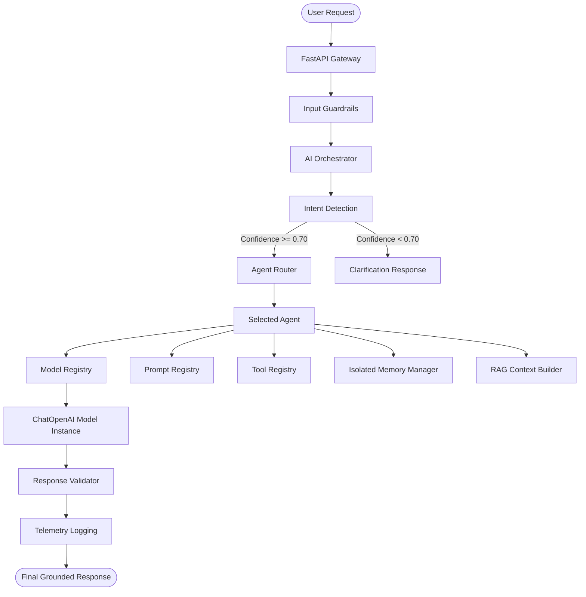

# SupplyMind AI Architecture: Enterprise AI Orchestration Layer

This document describes the Enterprise AI Orchestration Layer for the SupplyMind platform. The AI architecture is designed to enforce complete logical agent isolation, data-bound RAG filtering, independent hyperparameter configurations, and robust observability.

---

## Architecture Flow Overview



---

## Core Components

### 1. AI Orchestrator Gateway (`router.py`)
All requests to LLMs pass through this single orchestrator gateway. Frontend pages never make direct LLM calls. It coordinates:
* Guardrail safety checks.
* User intent classification.
* Logical routing to specialized agents.
* Hyperparameter and prompt assembly.
* Output verification.
* Observable logging.

### 2. Model Registry (`model_registry.py`)
The system centralizes ChatOpenAI model creation. While all models share the single OpenRouter API key configured in `.env`, every agent is provisioned with a logically distinct model client, carrying specialized settings:
* **Inventory Agent Model**: Low temperature (0.1), 2048 max tokens, strict output parsing.
* **Forecast Agent Model**: Low temperature (0.1), 2048 max tokens.
* **Customer Support Model**: Balanced temperature (0.3), 1024 max tokens.
* **Report Model**: Strategic temperature (0.1), 4096 max tokens, extended timeouts.
* **Executive Insights Model**: low temperature (0.1), 4096 max tokens.
* **Security Model**: Extremely low temperature (0.0), 512 max tokens.

### 3. Prompt Registry (`prompt_registry.py`)
Agent prompts are declared immutably. Agents load their system instruction sets on-demand from the registry. Prompts are never dynamically concatenated or reused between roles, preventing prompt leakage or role confusion:
* `InventoryPrompt`: Strict focus on stock positions, reorder thresholds (ROP), and EOQ calculations.
* `ForecastPrompt`: Focus on future demand trend patterns and supplier risk interpretations.
* `SupportPrompt`: Focus on platform navigational help, settings guide, and redirection for code/dev questions.
* `DocumentationPrompt`: Restricted to parsing general onboard guidelines and user documentation.

### 4. Memory Isolation (`memory_manager.py`)
Agent memories are stored in the database (`AgentMemory` table) and isolated by `agent_type`. An agent only retrieves short-term or long-term conversation memories that match its specific role. Past forecasting conversations will never leak into customer support chats.

### 5. RAG Context Builder (`context_builder.py`)
RAG queries strictly filter source documents by `source_type`:
* **Customer Support AI** is confined to searching documents with `source_type="general"` or `"insight"`.
* **Inventory Agent** exclusively accesses documents with `source_type="inventory"`, `"incident"`, or `"recommendation"`.
* Customer Support is physically prevented from querying internal inventory metrics or supplier profiles.

### 6. Intent Detector & Router (`intent_detector.py`, `router.py`)
Before routing, the user query's intent is classified using a model-based intent detector. The router compares the classification confidence score against a set threshold (`0.70`).
* **High Confidence**: The query is routed to the corresponding agent.
* **Low Confidence / Unknown**: The Orchestrator halts execution and requests user clarification instead of selecting an agent at random.

### 7. Telemetry & Observability (`telemetry.py`)
Every orchestration request records:
* Agent selected and routing confidence score.
* Model used and execution latency (in milliseconds).
* Token counts (input and output) and tool invocations.
* Success rates and execution errors.

---

## Directory Structure

```
backend/ai/orchestrator/
├── __init__.py            # Package entrypoint
├── config.py              # Central orchestrator config 
├── model_registry.py      # Dynamic LLM constructor
├── prompt_registry.py     # Clean system prompts for all agent roles
├── memory_manager.py      # Scoped long-term memory controller
├── tool_registry.py       # Decoupled agent tool definitions
├── context_builder.py     # Filtered RAG retrieval interface
├── conversation_manager.py # Scoped conversation transcript loader
├── response_validator.py  # Response guardrail checks
├── intent_detector.py     # LLM-based intent parser
├── agent_factory.py       # Scoped agent runners
├── router.py              # Main gateway workflow
└── telemetry.py           # Logging and analytics wrapper
```
