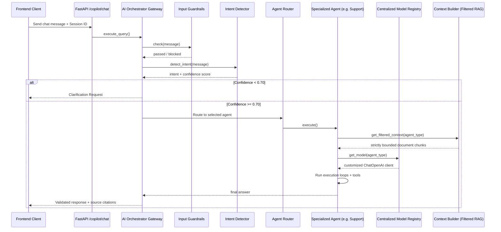

# SupplyMind Copilot Architecture: Orchestration-Based Chatbot

The **SupplyMind Copilot** serves as the central AI assistant for supply chain operators. It is integrated throughout the frontend web application (e.g., the floating chat widget and page summaries) and routed through the unified **AI Orchestration Layer**.

---

## High-Level Execution Flow

---

## Agent Routing Scope & Tool Bounds

The orchestrator enforces strict boundaries for tools and retrievers to prevent cross-agent context leakage:

| Agent / Intent | System Prompt Scope | Bound Tools | RAG Boundaries | Memory Scope |
|----------------|---------------------|-------------|----------------|--------------|
| **Inventory** | Stock levels, EOQ, reorder alerts, ROP, overstock risks | `analyze_inventory`, `search_inventory_knowledge` | `source_type="inventory"`, `"incident"`, `"recommendation"` | `agent_type="inventory"` |
| **Forecast** | Demand prediction analysis, seasonality, trend lines, supplier delays | `generate_forecast`, `search_forecast_knowledge` | `source_type="forecast"` | `agent_type="forecast"` |
| **Customer Support** | Navigational guide, dashboard KPIs explanation, settings walkthrough | `search_insights_knowledge` (Documentation FAQ) | `source_type="general"`, `"insight"` (No inventory access!) | `agent_type="customer_support"` |
| **Documentation** | Guide manuals, platform onboarding, FAQs | `search_insights_knowledge` | `source_type="general"` | `agent_type="documentation"` |
| **MLOps** | System resources, ML model health, retraining runs, drift stats | `get_mlops_metrics`, `search_mlops_knowledge` | `source_type="mlops"` | `agent_type="mlops"` |
| **Executive Insights** | Synthesize high-level forecasting and inventory summaries for C-level | None | `source_type="insight"`, `"report"` | `agent_type="executive_insights"` |
| **Report** | Generate structure of monthly, weekly, board-level CSV and PDF reports | None | `source_type="report"` | `agent_type="report"` |

---

## Dialogue Memory & Scoped History

* **Conversations**: Messages are stored in the SQL database (`conversations` table) with `agent_type` stored inside the metadata JSON block. When the frontend loads chat history for a session, the orchestrator retrieves and builds context using turns matching the active agent only.
* **Memories**: Long-term agent memories are stored in the `agent_memory` database table and filtered strictly using `agent_type` matching rules.

---

## Observability & LangSmith Tracing

All agent invocations, tool runs, and routing decisions are monitored and logged to the central console. By enabling `LANGCHAIN_TRACING_V2=true`, developer logs will detail the exact agent chain, sub-tool calls, and parsed outputs, enabling quick tracking of hallucinations or tool failures.
