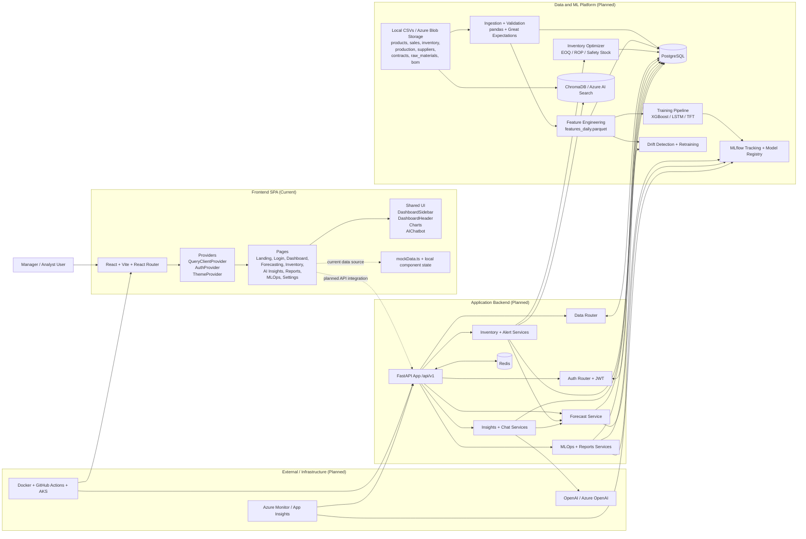

# 🚀 SupplyMind AI  
### AI-Powered Demand Forecasting & Inventory Optimization Platform  

---

## 👥 Team Members

- **Ibrahim Abdelsttar Abdelgawad**  
  *Team Leader – Deployment*

- **Kenzi Walid Sorour Hosny**  
  *LLM*

- **Rahma Shaaban Elhusseiny Shaaban**  
  *Data Analysis*

- **Karim Ayman Abdelgaber Deif**  
  *Modeling*

- **Ali El Shaarawy**  
  *MLOps*

- **Ali Ehab Massad Abdelghany**  
  *RAG*

---

## 📌 Overview

**SupplyMind AI** is an enterprise-grade SaaS platform designed to optimize supply chain operations through advanced demand forecasting, inventory optimization, explainable AI insights, and production-level MLOps monitoring.

The platform combines machine learning models, optimization algorithms, and intelligent monitoring systems to help businesses reduce stockouts, minimize overstock, optimize working capital, and improve operational efficiency.

---

## 🎯 Problem Statement

Modern businesses face critical supply chain challenges:

- Inaccurate demand forecasting  
- Excess inventory or frequent stockouts  
- Poor visibility into operational risks  
- Lack of explainability in AI decisions  
- Manual and reactive inventory planning  

SupplyMind AI addresses these challenges using data-driven predictive intelligence and automated optimization systems.

---

## 🔥 Core Features

### 1️⃣ Demand Forecasting Engine
- Multi-horizon forecasting (7 / 14 / 30+ days)
- Confidence intervals (probabilistic forecasting)
- Seasonality-aware modeling
- Promotion-aware forecasting
- Product-level and store-level predictions
- Continuous model retraining

---

### 2️⃣ Inventory Optimization Engine
- Reorder point calculation
- Safety stock estimation
- Optimal reorder quantity recommendations
- Lead time-aware planning
- Cost savings estimation
- AI-powered product-level recommendations

---

### 3️⃣ AI Insights & Explainability
- Feature importance analysis
- Demand factor contribution breakdown
- Seasonal pattern detection
- Promotion impact analysis
- Correlation discovery
- Actionable business insights

---

### 4️⃣ Intelligent Alert System
- Stock-out risk detection
- Overstock risk monitoring
- Demand spike alerts
- Real-time notifications

---

### 5️⃣ MLOps & Monitoring
- Model performance tracking
- Automated retraining triggers
- Data drift monitoring
- Inference latency monitoring
- Model version control
- Retraining history tracking

---

### 6️⃣ Reporting & Exports
- Weekly & monthly AI-generated reports
- Executive summaries
- CSV / PDF exports
- Scheduled reports

---

## 🏗️ System Architecture

# ☁️ Azure Cloud Infrastructure

| Component | Azure Service |
|------------|---------------|
| Data Ingestion | Azure Data Factory |
| Storage | Azure Data Lake / Blob Storage |
| Database | Azure PostgreSQL |
| ML Training | Azure Machine Learning |
| Model Registry | MLflow (Azure ML) |
| Deployment | Azure Kubernetes Service (AKS) |
| Monitoring | Azure Monitor |
| CI/CD | GitHub Actions + Azure DevOps |

---

## ⚙️ Technical Stack

### Machine Learning
- Python
- Scikit-learn
- XGBoost
- Time-Series Models (ARIMA / LSTM / Prophet)
- SHAP (Explainability)

### Backend
- FastAPI / Django
- REST APIs

### Frontend
- React (Dashboard Interface)

### Database
- PostgreSQL

### MLOps
- Model versioning
- Drift detection
- Automated retraining pipeline
- Performance monitoring

---

## 🔄 AI Pipeline

1. Data ingestion
2. Data cleaning & preprocessing
3. Feature engineering
4. Model training
5. Model evaluation
6. Deployment
7. Drift detection
8. Automated retraining

---

## 📊 Business Impact

SupplyMind AI enables organizations to:

- Reduce stock-out risk  
- Minimize excess inventory  
- Improve forecast accuracy  
- Optimize operational costs  
- Enhance supply chain resilience  
- Make explainable, data-driven decisions  

---

## 🚀 Future Improvements

- Multi-warehouse optimization
- Advanced anomaly detection
- Real-time streaming forecasts
- API integrations with ERP systems
- Advanced LLM-powered analytics assistant
- Scenario simulation engine

---

supplymind-ai/
│
├── backend/
│   ├── app/
│   ├── models/
│   ├── services/
│   ├── optimization/
│   └── api/
│
├── frontend/
│   ├── components/
│   ├── pages/
│   └── dashboard/
│
├── ml_pipeline/
│   ├── training/
│   ├── evaluation/
│   ├── feature_engineering/
│   └── drift_detection/
│
├── deployment/
│   ├── docker/
│   └── azure/
│
└── README.md

## 📌 Vision

To become the intelligence layer behind modern supply chain operations by combining forecasting, optimization, explainability, and MLOps into one unified AI-powered decision platform.

---

## 📄 License

This project is developed for academic and research purposes.
# Demand-Forecasting-Inventory-Optimization-Engine
