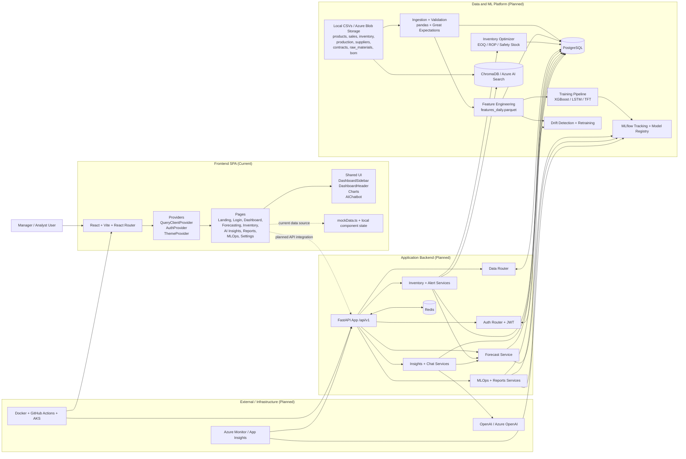
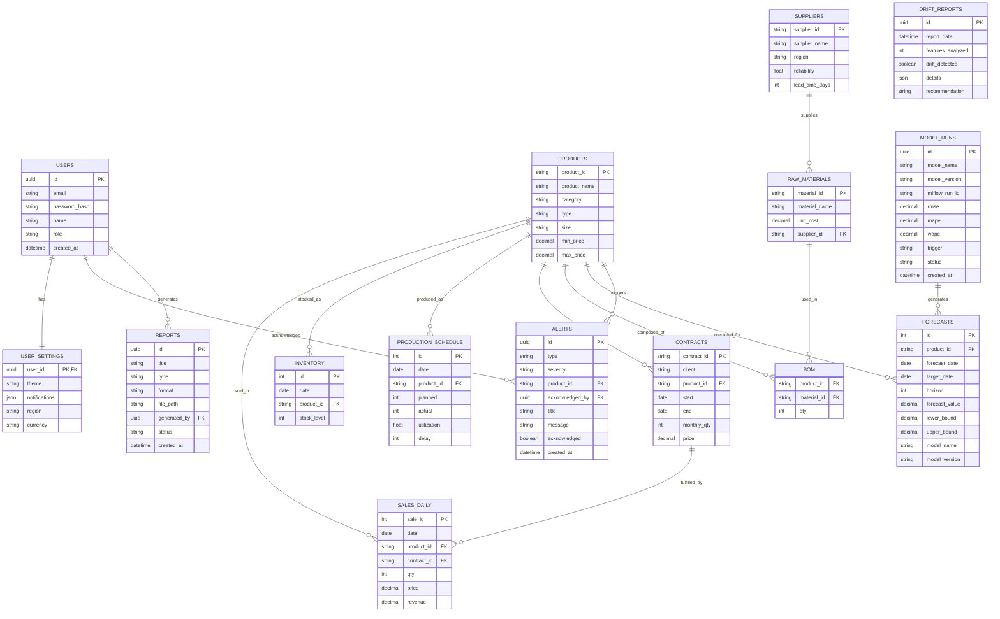
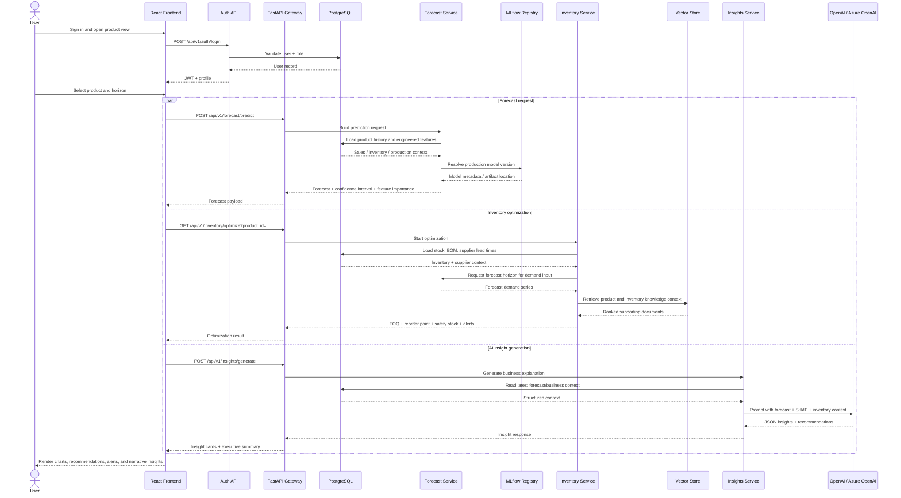

# SupplyMind AI Diagrams

This document combines:

- the implemented frontend in `src/`
- the real business datasets in `data/*.csv`
- the planned backend, ML, RAG, MLOps, and infrastructure layers from `plans/implementation_plan.md`

`Current` means already present in the repo today. `Planned` means defined in the implementation plan but not yet implemented in this codebase.

## 1. Full Project Architecture

## 2. ER Diagram

Notes:

- `PRODUCTS`, `SALES_DAILY`, `INVENTORY`, `PRODUCTION_SCHEDULE`, `SUPPLIERS`, `CONTRACTS`, `RAW_MATERIALS`, and `BOM` come from the current CSV data.
- `USERS`, `USER_SETTINGS`, `FORECASTS`, `ALERTS`, `MODEL_RUNS`, `DRIFT_REPORTS`, and `REPORTS` come from the implementation plan DDL.
- The `MODEL_RUNS -> FORECASTS` relationship is logical rather than an explicit foreign key in the current plan.

## 3. Sequence Diagram

This sequence models the target end-to-end user flow for the core product experience: forecast generation, inventory optimization, and AI insight retrieval from the frontend.

