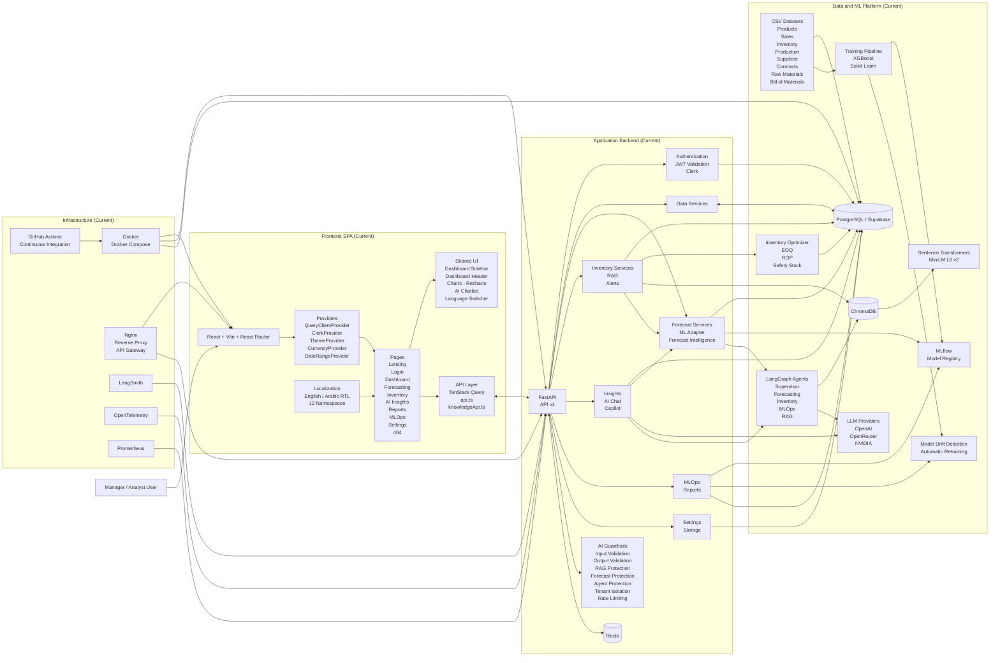
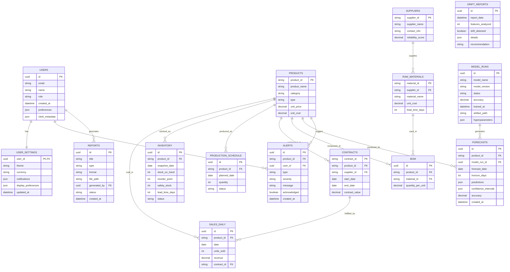
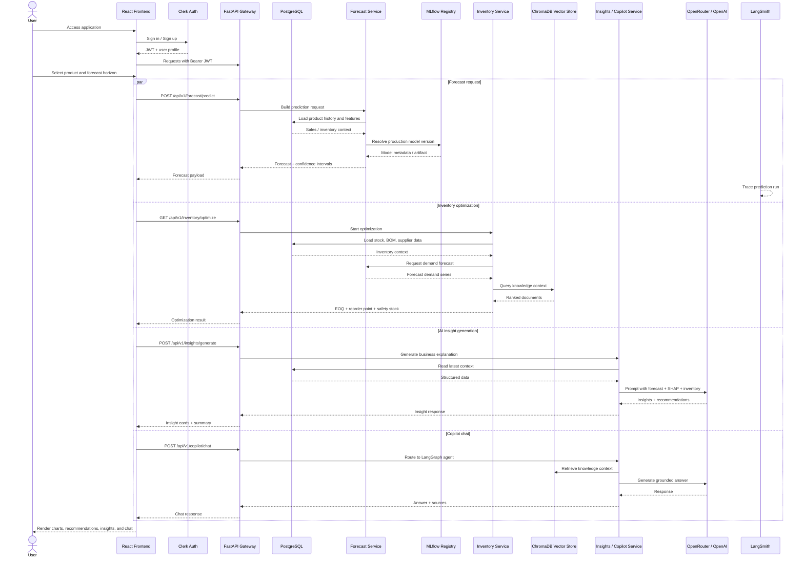

# SupplyMind AI Diagrams

This document combines:

- the implemented frontend in `frontend/src/`
- the real business datasets in `data/*.csv`
- the fully implemented backend, ML, RAG, MLOps, and infrastructure layers
- the `plans/implementation_plan.md` future roadmap

> **Status Key:** All layers below are **Current** (implemented in the repo). Future roadmap items are noted separately.

## 1. Full Project Architecture

## 2. ER Diagram

The database schema reflects the business domain with products, sales, inventory, production, suppliers, contracts, raw materials, bills of materials, users, forecasts, alerts, model runs, drift reports, and system reports.

## 3. Sequence Diagram

This sequence models the end-to-end user flow for the core product experience: forecast generation, inventory optimization, AI insight retrieval, and copilot interaction.

