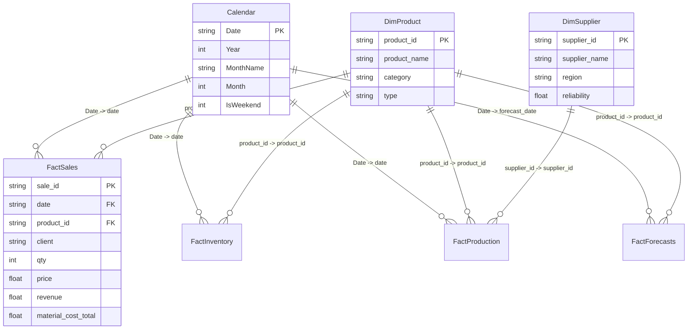

# SupplyMind AI - Power BI Dashboard Implementation Guide

We have analyzed your reference image and mapped it **exactly** to SupplyMind AI's data warehouse schema. The dashboard you shared is a perfect representation of our dataset:
*   **13 Products** (from `products.csv`)
*   **8 Suppliers** (from `suppliers.csv`)
*   **24 Clients** (from `contracts.csv`)

This guide provides the exact steps, relationship models, SQL/DAX formulas, and visual configuration settings needed to recreate this beautiful dashboard in Power BI Desktop.

---

## 1. Quick Start (Data Preparation)

We have created two utility files to automate the backend data bundling and visual styling:
1.  **Data Export Script** (`scripts/export_for_powerbi.py`): Run this to generate all clean fact and dimension tables under `data/powerbi_export/`.
2.  **Light Neumorphism Theme** (`docs/supplymind_theme.json`): Import this in Power BI Desktop to get the exact color palette (teal, coral, slate blue) and card shadow effects.

### Step 1: Run the Export Script
Open your terminal and execute:
```bash
python scripts/export_for_powerbi.py
```
This generates:
*   `products.csv`, `suppliers.csv`, `contracts.csv` (Dimensions)
*   `sales_enriched.csv` (Fact Sales)
*   `inventory_enriched.csv` (Fact Inventory)
*   `production_enriched.csv` (Fact Production)
*   `forecast_results.csv` (Fact Forecasts)
*   `calendar.csv` (Date Dimension for time-intelligence)

### Step 2: Open Power BI Desktop & Load Data
1.  Choose **Get Data** -> **Text/CSV**.
2.  Import all files from the generated folder: `data/powerbi_export/`.

### Step 3: Apply the Theme
1.  Go to the **View** tab in the top ribbon.
2.  Click the dropdown arrow in the **Themes** section.
3.  Click **Browse for Themes** and select [supplymind_theme.json](file:///d:/SupplyMindAI/docs/supplymind_theme.json).
4.  This instantly configures your canvas background to soft light grey (`#F3F4F6`), sets custom data colors, and gives every visual a white background, rounded corners, and a soft neumorphic drop shadow!

---

## 2. Data Model (Star Schema)

Configure the following relationships in the **Model View** tab of Power BI Desktop. Set all cross-filter directions to **Single** (Date dimension filters the Fact tables):



---

## 3. Custom DAX Measures

Create a new table named `_Measures` and insert the following formulas to populate your KPI cards, including Year-over-Year (YoY) and Month-over-Month (MoM) calculations with arrows:

### Core KPIs

```dax
// 1. Total Revenue
Total Revenue = SUM(sales_enriched[revenue])

// 2. Total Material Cost
Total Cost = SUM(sales_enriched[material_cost_total])

// 3. Number of Products
Number of Products = DISTINCTCOUNT(products[product_id])

// 4. Number of Suppliers
Number of Suppliers = DISTINCTCOUNT(suppliers[supplier_id])

// 5. Number of Clients
Number of Clients = DISTINCTCOUNT(contracts[client])

// 6. Total Quantity Sold
Total Quantity Sold = SUM(sales_enriched[qty])
```

### Time Intelligence (Growth vs Last Month/Year)

```dax
// 7. Revenue Last Month
Revenue LM = CALCULATE([Total Revenue], DATEADD('calendar'[Date], -1, MONTH))

// 8. Revenue Last Year
Revenue LY = CALCULATE([Total Revenue], SAMEPERIODLASTYEAR('calendar'[Date]))

// 9. Revenue MoM Change %
Revenue MoM % = 
VAR MoM = DIVIDE([Total Revenue] - [Revenue LM], [Revenue LM], 0)
RETURN MoM

// 10. Revenue YoY Change %
Revenue YoY % = 
VAR YoY = DIVIDE([Total Revenue] - [Revenue LY], [Revenue LY], 0)
RETURN YoY

// 11. Revenue MoM Label (Matches bottom of KPI Card)
Revenue MoM Label = 
VAR val = [Revenue MoM %]
RETURN 
    IF(val >= 0, 
        "▲ " & FORMAT(val, "0.0%"), 
        "▼ " & FORMAT(ABS(val), "0.0%")
    )

// 12. Revenue YoY Label
Revenue YoY Label = 
VAR val = [Revenue YoY %]
RETURN 
    IF(val >= 0, 
        "▲ " & FORMAT(val, "0.0%"), 
        "▼ " & FORMAT(ABS(val), "0.0%")
    )
```

*(Create similar formulas for Quantity Sold MoM / YoY labels to populate the bottom of the Quantity card).*

---

## 4. Visual Layout & Styling Guide

To match the clean Neumorphic interface from your screenshot, follow these visual configurations:

### Page & Canvas Settings
*   **Wallpaper / Page Background**: Clear transparency, color is automatically set to `#F3F4F6` by the theme.
*   **Visual Container Border**: Off.
*   **Shadow**: On (preset to light `#A3B1C8` shadow at 135 degrees, blur 8px, distance 4px). This gives the tiles a "raised" neumorphic effect.

### Layout Section-by-Section

#### 1. Left Sidebar (Slicer Pane)
*   **Sidebar Background**: Insert a solid rectangle shape. Fill color: White (`#FFFFFF`). Send it to the back.
*   **Logo Area**: Insert your Brand logo or Icon at the top left.
*   **Navigation Buttons**:
    *   **Overview Button**: Insert a rectangle shape with fully rounded corners (Pill). Fill color: `#72A8B5`. Font color: White (`#FFFFFF`). Text: "overview" (Centered, lowercase).
    *   **Inventory Button**: Pill shape. Fill color: Transparent. Border: `#D1D5DB` (thin line). Font color: `#A3B1C6`. Text: "Inventory".
*   **Dropdown Slicers**:
    *   Add 3 dropdown slicers: `calendar[Year]`, `calendar[MonthName]`, and `products[category]`.
    *   Format -> Slicer settings -> Style: **Dropdown**.
    *   Border: `#E5E7EB`. Font: `Segoe UI`.

#### 2. Top Row KPI Cards
Create **Multi-Row Cards** or standard **Cards** grouped together inside a neumorphic rectangle:
*   **Revenue Card**:
    *   Main Value: `Total Revenue` (formatted as Currency, Auto display units: e.g. `$137.24M`).
    *   Right side sparkline: Create a Line chart with `calendar[Date]` on the X-axis and `Total Revenue` on the Y-axis. Minimize all labels, titles, gridlines, and axes so only the sparkline remains. Place it next to the value.
    *   Subtext Labels: Create two text boxes or card visuals showing:
        *   `Vs Last Month   [Revenue MoM Label]` (Apply conditional formatting: Green for +, Red for -).
        *   `Vs Last Year    [Revenue YoY Label]`.
*   **Total Cost Card**: Shows `Total Cost` formatted as `$1.88M`.
*   **Number Cards**: Distinct count fields for Products (`13`), Suppliers (`8`), and Clients (`24`).
*   **Total Quantity Sold Card**: Displays `Total Quantity Sold` as `28K` with quantity sparkline and MoM/YoY growth labels.

#### 3. Center Analytics Visuals
*   **Demand Trend by Category (Line Chart)**:
    *   X-Axis: `calendar[MonthShort]` (Sorted chronologically by `calendar[Month]`).
    *   Y-Axis: `Total Quantity Sold`.
    *   Legend: `products[category]`.
    *   Lines: Set stroke width to `2px`, enable joint type: `Round`.
    *   Colors: Cooling = `#FFC5B4` (coral), Industrial = `#72A8B5` (slate blue), Kitchen = `#1F4E5B` (deep teal).
*   **Production Performance: Planned vs. Actual (Column & Line Chart)**:
    *   Use **Line and Clustered Column Chart**.
    *   X-Axis: `calendar[MonthName]`.
    *   Column Y-Axis (Left): `Sum of planned` (from `production_schedule[planned_qty]`). Set Column colors to `#72A8B5`.
    *   Line Y-Axis (Right): `Sum of actual` (from `production_schedule[actual_qty]`). Set Line color to `#FFC5B4`.
    *   Title: "Production Performance: Planned vs. Actual".

#### 4. Right Side Distribution Panels
*   **Top 5 Categories by Total Cost (Doughnut Chart)**:
    *   Legend: `products[product_name]`.
    *   Values: `SUM(sales_enriched[material_cost_total])`.
    *   Visual styles -> Details labels -> **Category, percent of total**.
*   **Reliability Distribution by Region (Doughnut Chart)**:
    *   Legend: `suppliers[region]`.
    *   Values: Average of `suppliers[reliability]`.
    *   Colors: Giza = `#1F4E5B`, Delta = `#72A8B5`, Upper = `#FFC5B4`.
*   **Revenue by Category (Pie Chart)**:
    *   Legend: `products[category]`.
    *   Values: `Total Revenue`.
    *   Colors: Cooling = `#FFC5B4`, Industrial = `#72A8B5`, Kitchen = `#1F4E5B`.

---

## 5. Connecting Directly to PostgreSQL (Alternative Live Data Source)

If you are running the platform in a production cloud environment, you can fetch live data instead of static CSV exports:
1.  Open Power BI Desktop.
2.  Choose **Get Data** -> **PostgreSQL database**.
3.  Enter your database server credentials from your `.env` `DATABASE_URL`:
    *   **Server**: Hostname of your database (e.g. `zjugkebpmiworbxcrjrm.supabase.co` or live server ip).
    *   **Database**: `postgres` (or name of database).
4.  Write the SQL statement to load the forecasts:
    ```sql
    SELECT 
        product_id,
        period,
        predicted_demand,
        confidence_level,
        demand_trend,
        current_stock,
        stock_risk_level,
        recommended_order_qty,
        supplier_score,
        best_supplier,
        lead_time_days,
        delay_risk,
        avg_delay,
        profit_margin,
        revenue_forecast,
        (period || '-01')::date as forecast_date
    FROM forecast_results
    ```
5.  Load this live data as your `FactForecasts` table.
